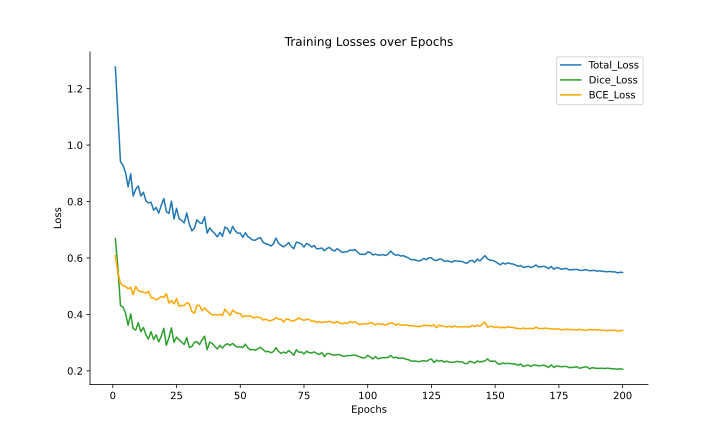
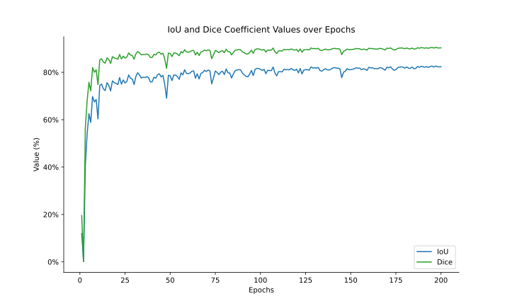

# AP-SAM
We propose a model that integrates a Convolutional Neural Network (CNN) with the Segment Anything Model (SAM) for automatic pore segmentation in rock SEM images. As shown in the figure below, this model is termed Auto-Pore SAM (**AP-SAM**).
AP-SAM is capable of automatically segmenting pores in scanning electron microscope images of rocks for automatic pore analysis. 
It prepares for 3D pore structure reconstruction, calculation of porosity and so on.
 
AP-SAM architecture
# Training records

Training records on mudstone data,we train 200 epochs on AP-SAM.

Original Mudstone dataset is available on [Digital Rocks Portal](https://www.doi.org/10.17612/BVXS-BC79)

Train loss on train set:


IoU and Dice Coefficient on vaild set(also test set):

# TODO 
- [x] Usage-install&inference
- [ ] Usage-Train
- [x] Ap-sam weight file
- [ ] Improve code readability

# Usage
## Installation
The code requires `python>=3.8`, as well as `pytorch>=1.7` and `torchvision>=0.8`. Please follow the instructions [here](https://pytorch.org/get-started/locally/) to install both PyTorch and TorchVision dependencies. Installing both PyTorch and TorchVision with CUDA support is strongly recommended.

After above installation, please install `opencv-python` `pycocotools` `matplotlib` `pillow` `numpy`(you can use requirements.txt to install)

### Example

In Linux

**1.Create and activate conda env:**

`conda create -n APSAM python==3.10`

**2.Activate it**

`conda activate APSAM`

**3.Install pytorch and torchvision (cuda version for GPU)**

`pip3 install torch torchvision torchaudio`

**4.Use requirements.txt install other :**

`cd AP-SAM`

`pip install -r requirements.txt`


**5.Download mudstone dataset**

Then modify `process_labels.py` to convert labels of the mudstone data to binarized maps containing only the pore and background.

**6.Split the dataset to `train` and `val`(test).**

(We will publish our dataset division later on)

## Inference(test)

Use `eval_APSAM.py` and `sh eval_ap_sam.sh` to test.

### Example
Download the the weight of AP-SAM fine-tined on mudstone dataset. [model checkpoint](#Fine-tuned-weight)
Put it in AP-SAM directory.

`AP-SAM/best_model.pth`

modify `eval_APSAM.py` to fit your dataset address.

then run `eval_ap_sam.sh`

`sh eval_ap_sam.sh`

the eval_result will show in command window.

## Train

coming soon


# Fine tuned weight

We provide the AP-SAM weights file after fine-tuning on the mudstone dataset. The model inputs are at 880x1024 resolution.

Download the fine-tuned AP-SAM in ViT-B version here.[Google Drive](https://drive.google.com/file/d/1qAdj6o_2KQveai4_fK6LrInSiNkt7Ds8/view?usp=sharing)


# Thanks 
We modified [HQ-SAM](https://github.com/SysCV/sam-hq) to AP-SAM
```
@inproceedings{sam_hq,
    title={Segment Anything in High Quality},
    author={Ke, Lei and Ye, Mingqiao and Danelljan, Martin and Liu, Yifan and Tai, Yu-Wing and Tang, Chi-Keung and Yu, Fisher},
    booktitle={NeurIPS},
    year={2023}
}  
```
Segment anything model:[SAM](https://github.com/facebookresearch/segment-anything)
```
@article{kirillov2023segany,
  title={Segment Anything},
  author={Kirillov, Alexander and Mintun, Eric and Ravi, Nikhila and Mao, Hanzi and Rolland, Chloe and Gustafson, Laura and Xiao, Tete and Whitehead, Spencer and Berg, Alexander C. and Lo, Wan-Yen and Doll{\'a}r, Piotr and Girshick, Ross},
  journal={arXiv:2304.02643},
  year={2023}
}
```

Mudstone dataset:[Original Dataset](https://www.doi.org/10.17612/BVXS-BC79)
```
Bihani, Abhishek, Daigle, Hugh, Prodanovic, Masa, Milliken, Kitty L., Landry, Christopher, E. Santos, Javier. "Mudrock images from Nankai Trough." Digital Rocks Portal,  Digital Rocks Portal, 22 Apr 2025, https://www.doi.org/10.17612/BVXS-BC79 Accessed 13 May 2025.
```
